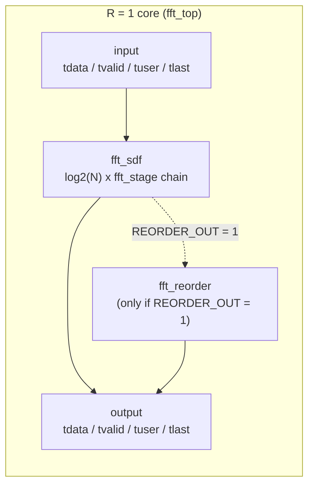
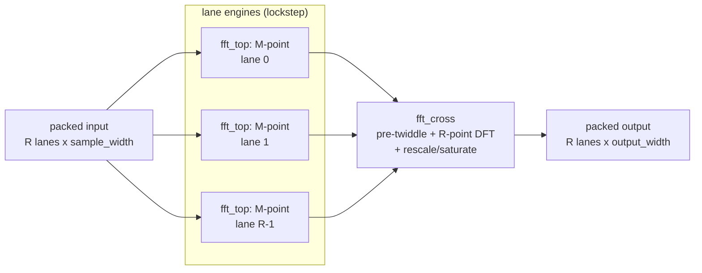
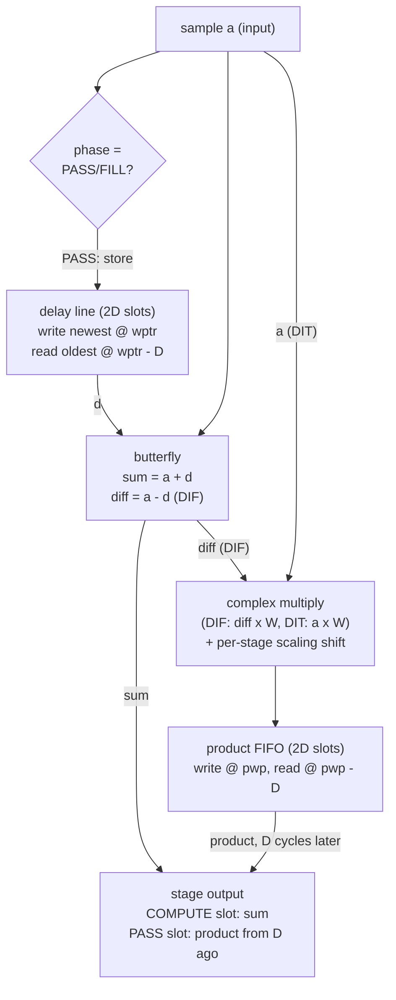
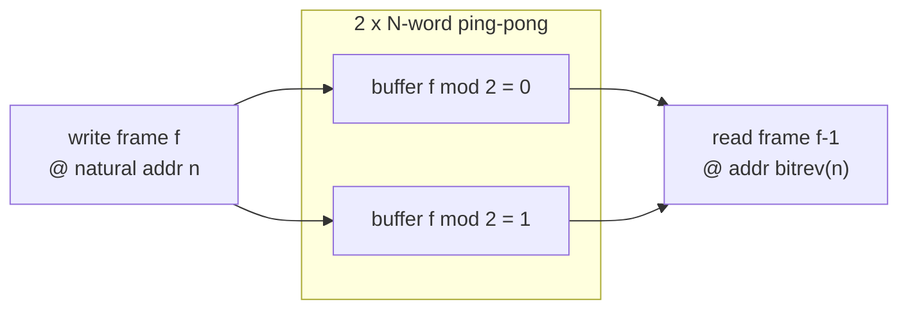
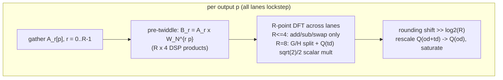

# fftgen core architecture

This document describes the architecture of the generated FFT/IFFT core as
implemented in `rtl/` and pinned by the golden models in `src/golden.py` /
`src/golden_ssr.py`. Design rationale and decision history live in
[PLAN.md](../PLAN.md); resource/timing results in [datasheet.md](datasheet.md);
memory-style cutoffs in [mem_cutoffs.md](mem_cutoffs.md).

> **Conventions.** "The core" means one instantiated configuration (fixed
> N, R, widths, ordering, scaling schedule). The generator emits a separate
> deliverable set per configuration; there is no runtime reconfiguration.
> All widths are signed two's-complement.

## 1. Design overview

The core is a **fully pipelined streaming** FFT/IFFT:

- one frame = N complex samples in, N complex samples out, continuously;
- frames run back-to-back with no gap and no start pulse;
- fixed deterministic latency `L` (reported in `params.txt`, asserted in
  tests) — output for a sample appears exactly `L` enabled cycles later;
- 100 % throughput: R output words per clock at steady state while `ce=1`;
- **no backpressure inside the core** — the datapath advances on
  `ce && s_axis_tvalid`; anything else freezes it bit-for-bit.

The R = 1 datapath is a **single-path delay feedback (SDF)** stage chain:
`log2(N)` cascaded stages, each with one delay line and one product buffer
per complex sample path. SDF was chosen for minimum multipliers and
near-minimum memory among continuous-stream topologies (comparison table in
PLAN.md §2.1). R > 1 (SSR) is *composed* from the verified R = 1 engine:
R lanes of an M-point core plus a small cross-lane combine, so SSR adds a
bounded verification surface rather than a new architecture.

Every datapath value is pinned bit-exactly by the Python golden model; the
RTL is required to be register-for-register identical. The fixed-point
contract (§6) is therefore part of the architecture, not an implementation
detail.

## 2. Top level

Two tops, selected by `ssr`:

**R = 1** (`fft_top.v`): the SDF core plus, only when the requested output
order differs from the core's natural order, a ping-pong reorder buffer.



**SSR** (`fft_ssr.v`): R lanes of an M-point `fft_top` (DIF + reorder, so
each lane emits its sub-FFT `A_r[p]` in native `p` order) feeding a
cross-lane combine (`fft_cross`).



Module map:

| File | Role |
|---|---|
| `rtl/fft_sdf.v` | R = 1 core: stage chain, twiddle ROM policy, output quantize, valid/marker logic (contains `fft_stage`) |
| `rtl/fft_top.v` | R = 1 binding wrapper: `fft_sdf` + optional `fft_reorder` |
| `rtl/fft_reorder.v` | N-deep ping-pong bit-reversal reorder buffer |
| `rtl/fft_ssr.v` | SSR top: R lane engines + crossbar wiring + marker plumbing |
| `rtl/fft_cross.v` | SSR cross-lane combine (pre-twiddle, R-point DFT, rescale) |

The exported deliverable set replaces `fft_top.v` with a generated
`fft_core.v` that bakes every parameter; the shared modules above are
copied in unchanged.

## 3. The R = 1 core (`fft_sdf`)

`fft_sdf` instantiates `NSTAGES = log2(N)` copies of `fft_stage` in series.
Stage `s` has delay depth `D_s`:

| Topology | `D_s` | Natural I/O order |
|---|---|---|
| DIF (`TOPOLOGY = 0`) | `N >> (s+1)` — N/2, N/4, …, 1 | native in → bit-reversed out |
| DIT (`TOPOLOGY = 1`) | `1, 2, 4, …, N/2` (mirrored) | bit-reversed in → native out |

Emitting the *matching topology* (rather than a shuffling wrapper) is what
makes half of the ordering space free — see §4.

### 3.1 SDF stage operation

Each stage keeps the incoming sample of one half of a 2D window in a delay
line and pairs it, D cycles later, with the second half. The phase flag
`in_compute` alternates in groups of exactly `D` samples:

- **PASS / FILL** (first half of the window): the raw input is written into
  the delay line at the write pointer; the stage output slot carries the
  product that a COMPUTE cycle stored in the product FIFO exactly D cycles
  earlier.
- **COMPUTE** (second half): input `a` is paired with the delayed sample
  `d` (read at `wptr − D`, structurally lagging the write); the butterfly
  **sum** goes out immediately, and the twiddled product is written to the
  product FIFO to be emitted D cycles later.



Two collision-free ring structures per stage (PLAN.md §2.7):

- **delay line**: `2D` slots, synchronous read, read address always
  `wptr − D`; the lag makes read and write addresses structurally disjoint.
- **product FIFO**: `2D` slots; the write (L9, COMPUTE) and the read (L9,
  PASS) share the same pipeline layer so the read/write windows align
  exactly.

The phase flag also rides the 10-layer pipeline as a 9-tap shift register
(`pipe_comp[k] = in_compute(t−k)`); each layer's phase-dependent behavior is
gated by its own tap. This is what lets the datapath stay one
`always` block deep while the RAMs and DSP register stages line up
cycle-for-cycle with the golden model.

The FSM state (pointers, phase, `in_compute`) is **preloaded post-reset**
with a per-stage warm start (`warm_s = −(Σ_{t<s} D_t + PIPE_DEPTH·s) mod 2·D_s`,
Appendix A of PLAN.md) so that the first frame's warmup garbage is flushed
by the fixed-latency valid gate (`out_valid = enabled_cycle ≥ L`) rather
than by any datapath reset — datapath registers carry no reset at all
(§9).

### 3.2 The 10-layer stage pipeline

The datapath inside `fft_stage` is exactly 10 pipeline layers per stage
(`PIPE_DEPTH = 10`, golden `NLAYERS = 10`), mirroring the DSP48E2 register
absorption chain:

```mermaid
flowchart LR
    L0["L0 capture<br/>delay-RAM out reg,<br/>input reg, twiddle reg"] --> L1["L1<br/>DSP input reg 1"]
    L1 --> L2["L2<br/>DSP input reg 2"]
    L2 --> L3["L3 butterfly<br/>pre-adder -> ADREG<br/>(ungated)"]
    L3 --> L4["L4 im-path products<br/>MREG + freeze re operands"]
    L4 --> L5["L5 re-path products<br/>+ C-port regs (CREG)"]
    L5 --> L6["L6 post-adder<br/>ALU: P -/+ C -> PREG"]
    L6 --> L7["L7 fabric combine<br/>align sum with product"]
    L7 --> L8["L8 round-half-up<br/>shift staging"]
    L8 --> L9["L9 output reg +<br/>product-FIFO write"]
```



| Layer | Registers | Hardware mapping |
|---|---|---|
| L0 | `d_bram`, `a_reg`, `t_reg` | delay-RAM output register (DOA_REG); input and twiddle capture |
| L1 | `d1/a1/t1` | DSP AREG/DREG + BREG (first hop) |
| L2 | `d2/a2/t2` | DSP AREG/DREG + BREG (second hop) |
| L3 | `bfly_d/bfly_s`, `t3` | pre-adder → ADREG; **ungated** — PASS values are never consumed, which lets Vivado map `d−a` into the DSP pre-adder instead of fabric carries |
| L4 | `prod2/prod4` + freeze regs | im-path products → MREG; re-path operands frozen one cycle |
| L5 | `c1/c2` + `prod1/prod3` | C-port regs (CREG); re-path products one cycle behind |
| L6 | `p` | post-adder ALU `P −/+ C` → PREG |
| L7 | `comb_s/comb_p` | fabric combine; delays the sum path to the product path depth |
| L8 | `shift_s/shift_p` | round-half-up right shift (ungated) |
| L9 | `out` + product-FIFO write | stage output; COMPUTE writes the rounded product at `pwp`, PASS reads at `pwp − D` |

The BRAM read address is modeled explicitly (`raddr`, always `wptr − D`);
it adds no data latency and matches the registered address in the RTL.

### 3.3 Complex multiply

The stage multiply is a **4-product split** with DSP48E2 C-port chaining,
giving **4 DSPs per stage** (P6: `4 × (log2(N) − 2)` per core for N ≥ 8 —
the DIF last two stages / DIT first two stages multiply only by
single-component twiddles (W^0, ±j) and emit exact fabric products via
`trivial_prod`, no DSPs):

```
im path  (L4, one cycle ahead):  prod2 = diff·t_re      prod4 = diff·t_im
re path  (L5, from frozen ops):  prod1 = diff·t_re      prod3 = diff·t_im
ALU      (L6):                   re = prod1 − c1        im = prod3 + c2
                                  (c1 = prod2, c2 = prod4, via CREG)
```

- the im-path products run one cycle ahead so their MREGs route into the
  re-path DSPs' C ports — the ALU then sees the same pair at P and C;
- the butterfly diff is computed **in the DSP pre-adder** (L3 ungated,
  §3.2); the pre-adder path is carried at `BW = WIDTH + 1` bits because two
  full-scale stage outputs can differ/sum to one bit more than the stage
  datapath before the scaling shift (root cause of the wide-N wrap bug,
  PLAN.md P4 notes);
- the 18-bit twiddle operand rides the DSP B port at its native width —
  sign- or zero-extend tricks that widen it split one multiply across two
  DSPs and were deliberately avoided.

A 3-multiplier Gauss/Karatsuba form was measured and **rejected**: the
DSP48E2 pre-adder sits in series with the multiplier, and the extra
pre-add term cost −0.78 ns WNS (PLAN.md P5a).

### 3.4 DIF vs DIT

Same stage, one parameter:

| | DIF (`TOPOLOGY = 0`) | DIT (`TOPOLOGY = 1`) |
|---|---|---|
| multiplied operand | butterfly **diff** (`a − d`) | **a** |
| stage outputs | sum `a + d` and `(a−d)·W` | `(d ± a·W)` |
| shift fusion | `>>SHIFT` on sum, `>>(td+SHIFT)` on product | same, applied to the two `d ± p` combines |
| delay depth ladder | N/2 → 1 | 1 → N/2 |
| resources | identical (mirror image) | identical |

IFFT is not a separate datapath: it is the same core with **conjugated
twiddle ROM contents** and a different scaling schedule (the 1/N factor is
distributed into the per-stage shifts). One RTL module, two generated
configurations. For run-time `FFT↔IFFT` the `INVERSE` `parameter` becomes
`input inv_i` (`generic DYNAMIC_INVERSE`): `W_N^k` `ti → -ti` (`1 XOR` on `Q` sign, magnitude-first table keeps `+1` saturated), `r22` `±j` (`js=−/+j`) and `fft_cross` `W_R^{rq}`/`W_N^{r p}` `±j`/`sqrt2/2` signs all mux on `inv_i` (`~30 LUT` total, `0` `BRAM/DSP`, `WNS` unchanged). `SCALING_PACK` `auto=(1,)*log2(N)` is identical for `FFT/IFFT`, so no `σ` mux is needed; `TOPOLOGY` (`D=N>>s+1` vs `1<<s`) stays as generated — `inv_i` keeps stream order (`native→bitrev` `DIF` or `bitrev→native` `DIT`, §4).

### 3.5 Twiddle storage

- The generator emits one `.mem` file per core: `N` packed `{re, im}` words.
  Stage `s` occupies entries `[BASE_s .. BASE_s + D_s − 1]` with
  `BASE_s = Σ_{t<s} D_t` — each stage reads its own slice, addressed by
  `ROM_BASE + pair_i` where `pair_i = phase_i mod D_s`.
- One ROM replica per stage (a BRAM has one synchronous read port; per-stage
  copies are physically equivalent for LUTRAM).
- Style: `auto` applies the measured cutoff — distributed LUTRAM until a
  RAMB36 per stage is cheaper (N ≥ 256 on the 16b/18b reference config;
  [mem_cutoffs.md](mem_cutoffs.md) S4), then block. In block mode the sync
  read is fused into the L0 capture so `t_reg` *is* the BRAM output
  register.
- **URAM never stores twiddles** (no power-up initialization); see §7.

### 3.6 Run-time `FFT↔IFFT` (`inv_i`)

`N=1024 R=1 r22` `KU5P 2ns`: static `INV=0` `3438 LUT 20 DSP -0.020` → dynamic `inv_i` `3507 LUT (+69 +2%) 20 DSP -0.020` (`FFT` `ti→-ti` `1 XOR`, `r22` `js` `1 LUT/stage`, `cross` `W_R` `~10 LUT`). `0` `BRAM/DSP` cost, `1` `FF` for `inv_i` `ce` hold; `generic DYNAMIC_INVERSE=0` keeps `parameter` `0` penalty.

**Order semantic with `inv_i`:** `inv_i` does **not** flip `native↔bitrev` — `TOPOLOGY` does. `FFT native→bitrev` `DIF` + `IFFT native→bitrev` `DIF` (same `D`) are *not* inverses as streams (`IFFT(FFT(x)) = R·x/N`). Closing `x/N native→native` needs `FFT native→bitrev` `DIF` + `IFFT bitrev→native` `DIT` (canonical `TX`/`RX` pair, `is_dit=input_order==bitreversed`). With `inv_i` alone the stream order stays as generated; to also flip order at run time add `1×N` `fft_reorder` after `DIF IFFT` or generate the `DIT` variant and mux `TOPOLOGY` (the `DYNAMIC_N` `Dcur` mux — `+22 LUT/stage`).

## 4. Output ordering (`fft_reorder`)

The DIF/DIT duality eliminates the reorder buffer for half the ordering
space:

| `input_order` | `output_order` | Generated topology | Reorder RAM |
|---|---|---|---|
| native | bit-reversed | DIF | none |
| bit-reversed | native | DIT | none |
| native | native | DIF + `fft_reorder` | 1× N |
| bit-reversed | bit-reversed | DIT + `fft_reorder` | 1× N |

Feeding bit-reversed input into the DIF datapath is *not* an option
(`F·R ≠ R·F`, checked numerically) — the DIT topology is the only free path.

`fft_reorder` is a ping-pong of two N-deep buffers: frame `f` is written
into buffer `f mod 2` at natural addresses while frame `f−1` is read from
the other buffer at bit-reversed addresses. The separate buffers keep read
and write addresses structurally disjoint (the URAM collision rule, §7) and
give a clean frame boundary. Latency: N enabled cycles (the first frame
must complete before reads start). It owns the frame markers: it consumes
input `tuser`/`tlast` and regenerates output markers.



## 5. SSR (R > 1 samples per clock)

Cooley–Tukey decomposition `N = R·M` (both powers of two, `R ∈ {2,4,8}`):

1. **Lane split** — the input word at clock `j` carries the R consecutive
   samples `x[R·j .. R·j+R−1]`; lane `r` takes `x[R·j + r]` (free wiring).
2. **Lane engines** — each lane is a full M-point `fft_top` (DIF core +
   reorder) emitting `A_r[p]` in native `p` order; all lanes run in
   lockstep, one `p` per clock.
3. **Crossbar** (`fft_cross`) — applies the pre-twiddle `W_N^{r·p}` (a
   distributed-async-read ROM of R rows, **including the r = 0 row in
   Q(td)** — skipping it makes one lane's contribution 2^td times smaller
   and the butterfly sums cancel it), then the R-point DFT across lanes,
   then one fused rounding shift `s_x = log2(R)` and a saturating rescale.

Combined with the lanes' `log2(M)` of stage shifts the total is
`log2(N)`, matching the R = 1 contract.



Pipeline depth is a fixed constant `CB_LAT`: **7** stages for R < 8 and
**11** for R ≥ 8. The first stage is a dedicated fabric input register
(`q_re/q_im`, twiddle riding the same +1 as `wa → wq`): the lane reorder
buffers are RAMB36s with ~1.25 ns clock-to-out, and letting that hop share a
cycle with DSP input setup was the R = 2 N = 8192 timing failure (WNS
−0.144 → −0.020 with the register; PLAN.md P5a). The R = 8 odd-bin scalar
multiply by Q(td)·√2/2 is split into two partial products
(`U_hi·c`, `U_lo·c`, one DSP48E2 each) because the 39×18-bit product does
not auto-infer.

**Output order contract:** emission is frame-synced (words dropped until
the first mature `p == 0` slot, then continuously valid), and output lane
`q` carries `X[qM + p]` — over a frame, lane `q` holds the *contiguous
block* `X[qM .. qM+M−1]` ("block-contiguous" order). Truly consecutive
per-word packing would need an M×R corner-turn buffer; that is deferred to
downstream.

**Markers:** SOF enters with sample `n = 0` (lane 0) and emerges on output
lane 0 at `p = 0`; EOF enters with `n = N−1` (lane `R−1`) and emerges on
lane `R−1` at `p = M−1`; the marker pipeline depth equals `CB_LAT`.

**Verification tolerance:** lane outputs are re-quantized at the crossbar
boundary, so an SSR core compares against the batch reference within
`R/2 + 1` LSB after word-offset alignment (documented double
quantization); R = 1 remains bit-exact.

## 6. Fixed-point contract

| Point | Operation |
|---|---|
| twiddle ROM | quantized Python-side to `twiddle_width` (Q(td)); contract per ROM word documented in `twiddle_map.txt` |
| complex multiply | **exact integer products, never quantized internally** — `sample_width + twiddle_width` always fits the 48-bit DSP accumulator with headroom |
| per-stage scaling | one round-half-up right shift per path per stage: sum path `>>σ_s`, product path `>>(td + σ_s)` (twiddle Q normalization fused with the stage shift, post-DSP) |
| SSR crossbar | one fused `>>log2(R)`, then round + saturate to `output_width` |
| output | rescale Q(sample_decimal) → Q(output_decimal), saturate to `output_width` (extended-domain comparisons cover the saturated extremes) |

- `scaling = "auto"` produces a **conservative** schedule: a worst-case
  full-scale sine cannot overflow *by construction* (the bound is proven
  over the schedule, not simulated), with shifts pushed as late as possible
  to minimize precision loss. The schedule is printed to `params.txt` and
  pinned by tests; explicit 0/1/2-bit-per-stage schedules remain available.
- The datapath stays in Q(sample_decimal) end-to-end; with the conservative
  schedule the reported spectrum is X_true/N (amplitude-preserving).
- All quantization helpers live in one module (`src/quant.py`), shared by
  the golden model and analysis tools — one canonical definition.
- Internal growth headroom: `INTERN_WIDTH = SAMPLE_WIDTH + max(0,
  num_stages − total_shift) + 1`.

## 7. Memory policy

Storage style is an explicit generator decision with **measured** cutoffs
(methodology and raw data: [mem_cutoffs.md](mem_cutoffs.md)):

| Array size | Style | Notes |
|---|---|---|
| ≤ 1024 bits | distributed (LUTRAM) | a RAMB36 would sit > 97 % empty |
| < 262 144 bits | block (RAMB36/E2) | up to 8 tiles, still cheaper than one URAM288 |
| ≥ 262 144 bits | ultra (URAM288) | deep lines only |

Invariants that make the style a pure implementation choice:

- **All reads synchronous, ≥ 1 output register** (2 by default — on BRAM
  the second maps to the free DOA/DOB hardware register). Every read
  address lags its write address, so read and write are structurally
  disjoint; on URAM (double-pumped, no collision modes) the port
  assignment cannot change behavior.
- **Initialization invariance:** stale power-up contents are always
  overwritten before they can be read, in *any* RAM style including
  uninitialized URAM. Hence twiddles (which need `INIT`) are confined to
  LUTRAM/BRAM; URAM is only ever a delay line / large buffer.
- **Reset clears pointers only.** In-flight contents are discarded and the
  fixed-latency contract restarts.

SSR adds per-lane reorder buffers (2M × width) that move to block RAM from
M ≥ 64. The crossbar WN ROM is deliberately distributed (async read fused
into the pre-twiddle multiply).

## 8. Interface & flow control

AXI4-Stream signal naming and packing **without `tready`**:

| Signal | Direction | Meaning |
|---|---|---|
| `clk`, `rst` | in | `rst` is synchronous and controls *control state only* |
| `ce` | in | clock-enable freeze; datapath advances on `ce && s_axis_tvalid` |
| `s_axis_tdata_re/im` | in | I/Q lanes, `lane i at [i·W +: W]` (R lanes packed for SSR) |
| `s_axis_tvalid` | in | sample present this cycle |
| `s_axis_tuser` | in | start-of-frame (with sample `n = 0`) |
| `s_axis_tlast` | in | end-of-frame (with sample `n = N−1`) |
| `m_axis_*` | out | same set on the master side |

Behavioral contract:

- the datapath is a **pure clock-enable freeze**: while `ce=0` or
  `tvalid=0` every value holds; no sample is lost, altered, or duplicated;
- `m_axis_tvalid` is low during reset/fill and whenever frozen — consumers
  never see stale data twice (the SSR crossbar `fft_cross` implements the
  same rule — `out_valid` is gated on `run` — regression-tested in
  tests/test_rtl_ssr_freeze.py);
- `tuser`/`tlast` ride at the fixed latency `L`, uninterpreted by the
  datapath; their only job is off-by-one detection (the golden model asserts
  marker alignment every frame);
- flow control is deliberately **outside** the core: a producer that
  cannot sustain full rate gates `ce`; a consumer that cannot keep up
  buffers a frame in an output FIFO and gates `ce`. A
  standards-compliant `tready` wrapper is a thin future module around the
  verified datapath.

Latency: the first valid output appears after exactly `L` enabled cycles
(`LATENCY = N + PIPE_DEPTH·log2(N)` in `fft_sdf`, plus reorder/crossbar
stages where present) — a deterministic constant derived by the generator,
printed to `params.txt`, and asserted per configuration in the test suite.

SSR frame sync (crossbar + golden model): fill frames are dropped and
emission starts at the first p==0 slot after the pipeline fills (mature
= scnt > CB_LAT+1 — the p0 word whose output cycle is mature; frame 2's
first word for M >= 8). A single-frame stream produces no output — the
generator prepends `pad_frames` fillers; direct consumers must supply
>= 2 frames.

## 9. DSP mapping & reset policy

- **Asymmetric ports by design:** sample data occupies the DSP A/pre-adder
  port (`sample_width ≤ 25/27`), twiddles occupy the B port
  (`twiddle_width ≤ 18`) — mirroring the DSP48 hard macro (7-series E1,
  UltraScale+/Versal E2/58 presets). The bound is on the *effective*
  internal width `INTERN_WIDTH + 1` (the stage butterfly width), where
  `INTERN_WIDTH = sample_width + max(0, num_stages − Σshifts) + 1` — so a
  weak scaling schedule lowers the ceiling. `fft_gen` rejects
  out-of-envelope configs at the RTL boundary
  (`_check_dsp_envelope`), keeping the golden models free of the limit.
- The 10-layer chain is written to absorb the full DSP48E2 register
  budget: the im-path product DSPs take AREG=2, BREG=2, DREG=1, ADREG=1,
  MREG=1, CREG=1, PREG=1 (audited netlist-level, PLAN.md P5a).
- **No resets on datapath registers** (RAM output regs, DSP stages): their
  pre-first-valid contents are don't-care by construction (same argument as
  §7 initialization invariance). Control registers use synchronous reset
  only. No asynchronous resets anywhere.
- Consequence: outputs preceding the fill latency are undefined and excluded
  from comparison; the mid-run-reset test asserts clean recovery via control
  state only.

## 10. Relationship to PLAN.md

Two PLAN.md §2.1/§7.5 aspirations are **not** in the shipped RTL — the
implemented core is deliberately simpler, and Appendix A records the
consequences:

| Plan | Implementation | Why |
|---|---|---|
| radix-2² SDF (≤ N/4 multiplies) | **plain radix-2 SDF** (`log2(N)` stages, each multiplying every pair) — P7 is folding this in | the R2² merge changes which cycles carry multiplies AND the product rounding points; spike S5 (spikes/S5_r22/) proved the contracts differ by a few LSB (not bit-identical, SQNR-equal) and re-pinned the golden (`fft_fixed_batch_r22` / `_r22_dit`); the R2² stage RTL is the remaining P7 work (background reading in §11) |
| 3-DSP Karatsuba complex multiply | **4-product split with C-port chaining** (4 DSPs/stage) | 3-multiply Gauss/Karatsuba forms measured worse on timing (pre-adder in series with the multiplier, −0.78 ns WNS); evidence kept in PLAN.md P5a |

Everything else in this document is register-for-register the RTL; where the
two ever diverge, the golden model + test suite is the arbiter.

## 11. Further reading: pipelined FFT architectures and radix-2²

The radix-2² FFT is the "radix-4 with radix-2 butterflies" restructure: it
keeps the same multiplicative complexity as radix-4 (log₂(N)/2 nontrivial
complex multiplies) while using only 2-input butterflies, so it maps onto
an SDF pipeline without changing the adder/memory topology. The references
below are ordered from "start here" to "deeper".

**The original R2²SDF** (the topology this project is folding toward):

- S. He and M. Torkelson, *"Designing pipeline FFT processor for OFDM
  (de)modulation,"* Proc. URSI Int. Symp. Signals, Systems, and
  Electronics (ISSSE '98), Pisa, Italy, 1998, pp. 257–262.
  The R2²SDF paper: one complex multiplier per stage PAIR, with the
  first sub-stage's twiddles collapsed to ±1/±j via the twiddle-factor
  restructure. This is the canonical "why half the multipliers" read.

- S. He and M. Torkelson, *"A new approach to pipeline FFT processor,"*
  Proc. 10th Int. Parallel Processing Symp. (IPPS '96), Honolulu, HI,
  1996, pp. 766–770.
  The earlier topology work (radix-4 SDF / SDC pipelines) that the R2²
  paper builds on; good for the SDF vs. MDC memory/multiplier trade-offs.

**Pipelined FFT topologies in general (SDF / MDC taxonomy):**

- E. E. Swartzlander, Jr., W. K. W. Young, and S. J. Joseph, *"A radix 4
  delay commutator for fast Fourier transform processor implementation,"*
  IEEE J. Solid-State Circuits, vol. SC-19, no. 5, pp. 702–709, 1984.
  The classic MDC (multi-path delay commutator) pipeline — the
  alternative to SDF that Spiral-style feed-forward cores resemble.

- U. Meyer-Baese, *Digital Signal Processing with Field Programmable
  Gate Arrays*, Springer (4th ed. 2014). The FPGA-FFT textbook chapter:
  radix-2/4 butterflies, SDF/MDC pipelines, twiddle ROM quantization.
  Best single book for the background if you want the fixed-point
  context for our Q-format contract.

- K. K. Parhi, *VLSI Digital Signal Processing Systems: Design and
  Implementation*, Wiley, 1999. Pipelined FFT (SDF/MDC) and CORDIC-based
  alternatives, from the VLSI scheduling angle (why the multiplier
  duty-cycle argument in §3.3 works).

**Where the "fewer multiplies" actually comes from (algorithm side):**

- P. Duhamel and H. Hollmann, *"'Split radix' FFT algorithm,"* Electronics
  Letters, vol. 20, no. 1, pp. 14–16, 1984. The split-radix algorithm —
  the closest relative of radix-2² in pure arithmetic complexity. Radix-2²
  is the version that stays pipeline-friendly; split-radix's irregular
  structure does not.

**R2² in feed-forward (not feedback) form — the Spiral-style cores:**

- M. Garrido, J. Grajal, M. A. Sánchez, and O. Gustafsson, *"Pipelined
  radix-2² feedforward FFT architectures,"* IEEE Trans. Very Large Scale
  Integr. (VLSI) Syst., vol. 21, no. 1, pp. 23–32, 2013. Radix-2² applied
  to the feed-forward (memory-permutation) pipeline — directly relevant
  to the Spiral-style 2-stream core we compared against (40 DSPs at
  R=2 N=2048 vs. our 68): same multiplier count as R2²SDF, but with
  permutation RAMs instead of feedback delay lines.

- P. A. Milder, F. Franchetti, J. C. Hoe, and M. Püschel, *"Computer
  generation of hardware for linear digital signal processing
  transforms,"* ACM Trans. Design Autom. Electron. Syst. (TODAES),
  vol. 17, no. 2, 2012. The Spiral HDL generator: how the feed-forward
  streaming FFTs (including the `spiral_2048x2.v` core we examined) are
  composed and how their schedules are derived.

- P. A. Milder, F. Franchetti, J. C. Hoe, and M. Püschel, *"Formal
  datapath representation and manipulation for implementing DSP
  transforms,"* IEEE Trans. Comput.-Aided Design Integr. Circuits Syst.,
  vol. 27, no. 9, pp. 1616–1630, 2008. The underlying datapath algebra
  (multidimensional SPL-style factorization) behind the generator.

Our own P7 work (spike S5, re-pinned R2² contracts) is documented in
`spikes/S5_r22/notes.md` and PLAN.md §5 (P7 row); the one numerical
nuance the literature skips is the fused Q-format rounding interaction
analyzed there.
